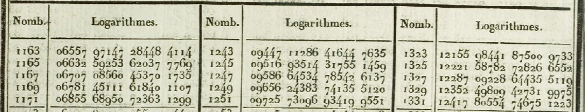
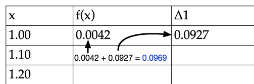
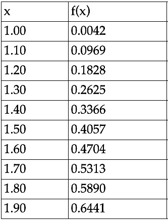

# Log Tables

This project generates materials for computing log tables by hand.

## How to use it

### Generating new tables

To generate a new set of log tables, visit the website
https://travisbarrydick.github.io/logtables/dist/. When you click the "Generate"
button, the page will become populated with unfilled and filled log tables. If
you print the webpage, each table will be printed on its own page to make them
easier to distribute to students. For cleaner handouts, disable headers and
footers when printing the tables. You can use the filled tables to check for
errors.

There are a number of parameters you can configure to customize the tables:

- `Start`: the smallest value of log to compute.
- `Increment`: The spacing between computed function values.
- `Rows per table`: The number of rows in each table.
- `Number of tables`: The total number of tables to produce.
- `Degree`: The degree of the Taylor expansion used to approximate the function
   (higher degrees correspond to better approximations).
- `Precision`: The number of decimal places to show in each table entry.

### Filling in tables

Filling in the empty log tables only requires students to add and subtract
numbers. The value in each cell of the table should be computed by adding
the number directly above it, to the number above and to the right. Note that
some numbers in the table can be *negative*.

Since the top row and right column are filled automatically, the students can
work their way from the top right to the bottom left filling entries as they go.
In fact, students only need to fill enough of the table to compute the entries
in the `f(x)` column, allowing them to skip some entries in the bottom right
corner.

### Reading the tables

Once the tables are complete, you can read off values of the log function using
the first two columns of each table. For example, using the table below, we see
that `log(1.5)` is approximately equal to `0.4057`, which is accurate to the 3rd
decimal place.

## How it works

The preparation details of the worksheets/tables generated by this website are
historically inaccurate, though based on similar principles. There are two key
ideas: [Taylor polynomials](https://en.wikipedia.org/wiki/Taylor_series) and the
method of [divided
differences](https://en.wikipedia.org/wiki/Divided_differences). First, we use
Taylor polynomials to closely approximate the log function for a small range of
input values. The advantage is that polynomials can be evaluated using only the
basic operations of addition, subtraction, and multiplication. However, even
though these Taylor polynomials can in principle be evaluated by hand, the
process is tedious and error-prone. The second idea is to use the method of
divided differences to evaluate the Taylor polynomials at regularly spaced input
points. The method of divided differences has two advantages: it can be
performed using only a small number of addition and subtraction operations, and
it shares many calculations between successive evaluations of the polynomial,
rather than needing to start from scratch for each input point. Each
worksheet/table produced by this website corresponds to a single Taylor
polynomial approximation to the log function, and filling in the table
corresponds to running the method of divided differences to evaluate that
polynomial at equally spaced points.
